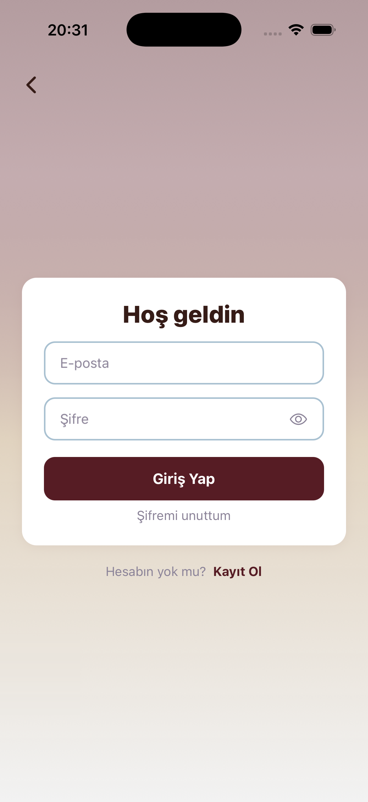
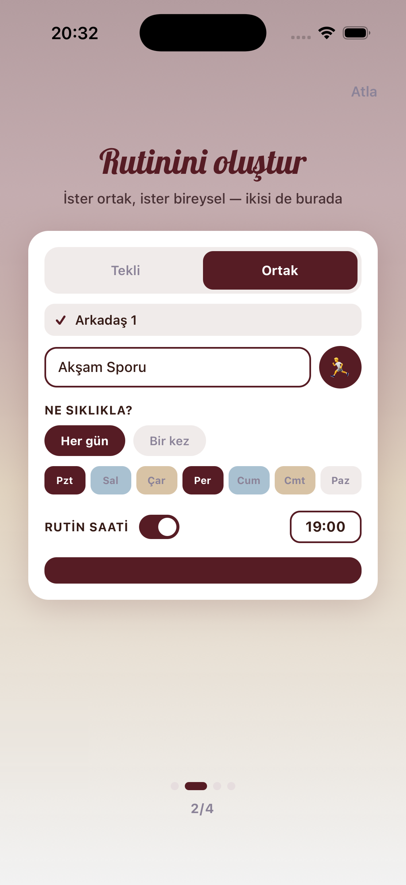
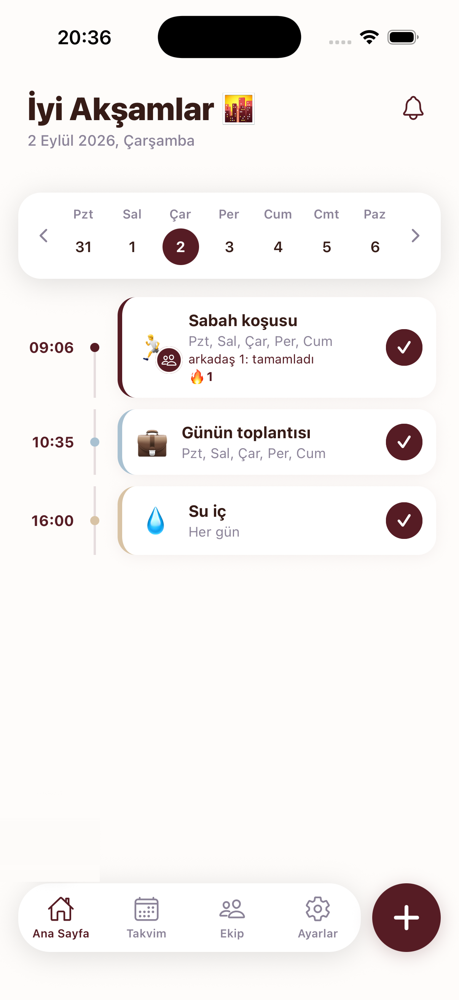
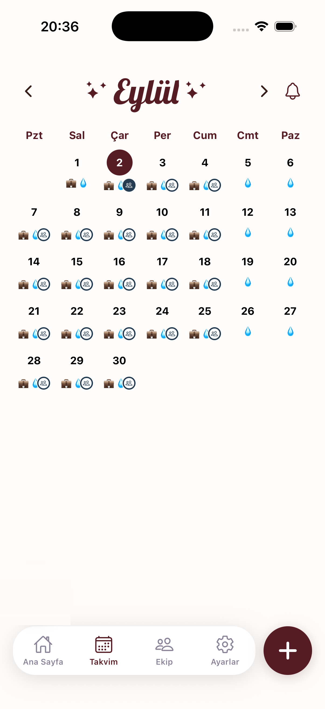

# HabitTeam


React Native / Expo ile geliştirilen bir alışkanlık & rutin takip uygulaması. Kendi rutinlerini tek başına takip edebilir; ayrıca bir arkadaşınla **ortak rutin (co-op)** kurup ikinizin de tamamlamasına bağlı ortak bir seri (streak) büyütebilirsin.

> Sürüm: **0.9.0** · Platform: iOS + Android (portrait)

---

## Özellikler

**Hesap**
- E-posta / şifre ile kayıt ve giriş (Firebase Authentication)
- E-posta doğrulama akışı, "Şifremi Unuttum", şifre ve kullanıcı adı değiştirme
- Kalıcı hesap silme (tüm kullanıcı verisi temizlenir)

**Onboarding**
- Uygulamanın gerçek akışını statik önizleme kartlarıyla tanıtan 4 slaytlık giriş (kaydırmalı, atlanabilir; bir kez gösterilir)

**Ana Sayfa**
- Haftalık takvim + saat bazlı timeline görünümü
- Rutin oluşturma / düzenleme / silme, tamamla & geri al
- Günden güne kaydırarak gezinme; geçmiş/gelecek günler salt-okunur
- Rutin adından otomatik emoji seçimi

**Takvim**
- Aylık takvim, gün hücrelerinde tamamlanma göstergeleri
- Gün detayında saatsiz rutinler + 24 saatlik timeline

**Rutin Oluşturma**
- Tekli veya ortak (arkadaşla) rutin
- Tekrar: her gün / belirli günler / tek sefer
- İsteğe bağlı saat hatırlatıcısı

**Ortak Rutinler (Co-op)**
- Davet kodu ile arkadaş ekleme
- Arkadaşlarla ortak rutin oluşturma ve davet gönderme, daveti kabul/ret
- Grup senkronlu seri: seri yalnızca tüm aktif üyeler o gün tamamladığında ilerler
- Üye yönetimi: üye çıkarma, sahiplik devri, "yalnız kalınca" ortak rutini bireysele çevirme

**Bildirimler**
- Tamamlanmamış rutinler için akşam yerel hatırlatma
- Ortak rutin davetlerinde push bildirimi

---

## Ekran Görüntüleri

|  |  |
|:---:|:---:|
| <br>**Welcome** | <br>**Onboarding** |
| <br>**Ana Sayfa** | <br>**Takvim** |

---

## Teknoloji Yığını

| Katman | Teknoloji |
|---|---|
| Framework | Expo SDK 56 (`~56.0.15`) + React Native `0.85.3` |
| Dil / UI | TypeScript `~6.0.3`, React `19.2.3` |
| Backend | Firebase `12.x` — Authentication + Cloud Firestore (modüler web SDK) |
| Navigasyon | React Navigation 7 (`native-stack`) |
| Animasyon & jestler | `react-native-reanimated` 4.3.1, `react-native-gesture-handler` |
| Yerel depolama | `@react-native-async-storage/async-storage` |
| Diğer | `expo-notifications`, `expo-linear-gradient`, `react-native-svg`, `@gorhom/bottom-sheet`, `expo-haptics`, `@react-native-community/datetimepicker`, `@expo-google-fonts/lobster` |
| Test / Lint | Jest (`jest-expo`), ESLint (`eslint-config-expo`) |

---

## Mimari ve Teknik Öne Çıkanlar

- **Grup-senkronize seri (streak) modeli** — Ortak rutinde seri, yalnızca o gün aktif olan **tüm** üyeler rutini tamamladığında ilerler; her üyenin sayacı kendi katılım tarihinden öteye gitmez. Sayaç Firestore'da tutulmaz, her render'da tamamlanma kayıtlarından geriye doğru hesaplanır (cron / Cloud Function gerektirmez).
- **Dinamik üyelik yönetimi** — `memberSince` / `memberUntil` alanlarıyla tarih-farkında geçmiş hesaplama: bir üye ayrılsa veya sonradan katılsa bile geçmiş günlerin tamamlanma/seri verisi bozulmaz; ayrılmış üyenin adı geçmiş kayıtlarda doğru gösterilmeye devam eder.
- **Alan-kısıtlamalı Firestore güvenlik kuralları** — Davet kabul/red ile içerik düzenleme yetkileri ayrı `allow` kurallarına bölündü; bir isteğin hangi alanları değiştirebileceği (`affectedKeys`) sunucu tarafında kısıtlanıyor. Ortak rutinler yalnızca Firestore'da karşılıklı arkadaş kaydı olan kişiler arasında açılabiliyor; tamamlanma kayıtları bağlı rutinle çapraz doğrulanıyor.
- **Atomic Firestore yazmaları** — Rutin tamamlama gibi çok adımlı işlemler (`habit.completedDate` güncelleme + `completions` kaydı yazma/silme) `writeBatch` ile tek atomik operasyonda yapılıyor; ağ hatasında iki kaynağın sessizce ayrışması engelleniyor.

---

## Kurulum

Gereksinimler: Node.js 18+, [Expo Go](https://expo.dev/go) uygulaması ya da iOS/Android simülatörü, bir Firebase projesi (Authentication → E-posta/Şifre etkin, Cloud Firestore açık).

```bash
# 1. Repoyu klonla
git clone https://github.com/rumeysacayhan/habitteam.git
cd habitteam

# 2. Bağımlılıkları yükle
npm install

# 3. Ortam değişkenlerini ayarla
cp .env.example .env
#    .env dosyasını açıp kendi Firebase projenin bilgilerini gir:
#    EXPO_PUBLIC_FIREBASE_API_KEY, _AUTH_DOMAIN, _PROJECT_ID,
#    _STORAGE_BUCKET, _MESSAGING_SENDER_ID, _APP_ID

# 4. Çalıştır
npx expo start
```

Firestore güvenlik kuralları ve indeksleri repo kökündeki `firestore.rules` / `firestore.indexes.json` dosyalarında; kendi projene deploy etmek için `firebase deploy --only firestore`.

Diğer komutlar:

```bash
npm test        # Jest testleri
npm run lint    # ESLint
```

---

## Proje Yapısı

```
habitteam/
├── App.tsx                  # Uygulama girişi (font + splash + provider'lar)
├── app.json                 # Expo konfigürasyonu
├── firestore.rules          # Firestore güvenlik kuralları
├── firestore.indexes.json   # Firestore composite index tanımları
│
├── assets/                  # Uygulama ikonları + ekran görüntüleri
└── src/
    ├── config/              # Firebase başlatma (app, auth, db)
    ├── context/             # React Context sağlayıcıları (Auth, davetler)
    ├── navigation/          # React Navigation yapısı (Root / Auth / App)
    ├── screens/             # Uygulama ekranları (Home, Calendar, Create, Settings, Friends, Auth ekranları…)
    ├── components/          # Paylaşılan UI bileşenleri (butonlar, input, dekoratif arka plan, modaller)
    ├── hooks/               # Firestore veri hook'ları (habits, coop) + UI hook'ları
    └── utils/               # Yardımcılar (tarih, emoji, seri hesabı, bildirim, hata mesajları) + testler
```

---

## Geliştirici

[@rumeysacayhan](https://github.com/rumeysacayhan)

---

## Not

Bu, kişisel bir portföy projesidir ve private repo olarak tutulmaktadır. Herkese açık bir dağıtımı yoktur.
